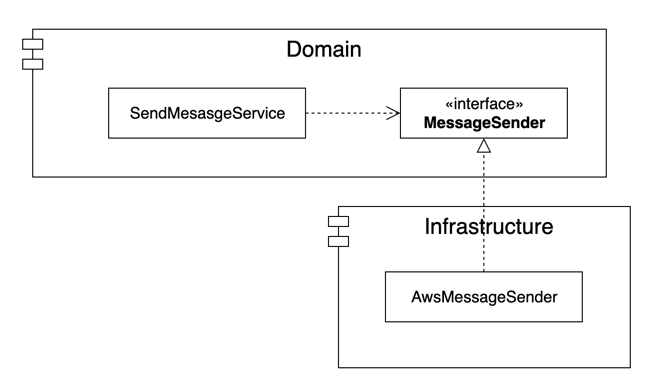
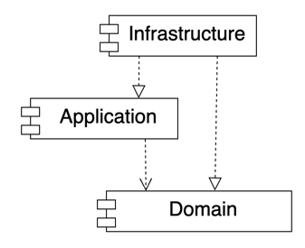

# Chapter 2. 아키텍처 개요

## 2.1 네 개의 영역
* 표현 계층
  * 사용자의 요청을 받아 응용 계층에 전달하고, 응용 계층의 처리 결과를 다시 사용자에게 보여주는 역할
* 응용 계층
  * 기능을 구현하기 위해 도메인 영역의 도메인 모델을 사용한다.
  * 응용 서비스는 로직을 직접 수행하기보다는 도메인 모델에 로직 수행을 위임한다.
* 도메인 계층
  * 도메인 모델을 구현한다.
  * 도메인 모델은 도메인의 핵심 로직을 구현한다.
* 인프라스트럭처 계층
  * 구현 기술에 대한 구체적인 사항을 다룬다. (RDBMS나 메시지 큐 등..)

## 2.2 계층 구조 아키텍처
* 계층 구조는 그 특성상 상위 계층에서 하위 계층으로의 의존만 존재하고 하위 계층은 상위 계층에 의존하지 않는다. (ex. OSI 7 Layer)
* 계층 구조를 엄격하게 적용한다면 상위 계층은 바로 아래의 계층에만 의존을 가져야 하지만 구현의 편리함을 위해 계층 구조를 유연하게 적용하기도 한다.
  * 예를 들어 응용 계층은 도메인 계층에 의존하지만, 외부 시스템과의 연동을 위해 인프라스트럭처 계층에 의존하기도 한다.
* 하지만 표현, 응용, 도메인 계층이 상세한 구현 기술을 다루는 인프라스트럭처 계층에 종속된다.
* 세부사항을 다루는 인프라스트럭처에 종속되면 아래와 같은 문제가 발생한다.
  * 테스트하기 어렵다.
  * 세부사항에 의존하기 때문에 변경에 취약하여 기능 확장이 어려워진다.

## 2.3 DIP

### 고수준 모듈과 저수준 모듈
* 고수준 모듈은 의미있는 단일 기능을 제공하는 모듈이다.
* 고수준 모듈의 기능을 구현하려면 여러 하위 기능이 필요하다.
* 저수준 모듈은 하위 기능을 실제로 구현한 것이다.
* 고수준 모듈은 저수준 모듈을 사용해야 동작할 수 있다.
  * 하지만 고수준 모듈이 저수준 모듈에 의존하면 아까와 같이 구현 변경와 테스트가 어렵다는 문제가 발생한다.
* DIP는 저수준 모듈이 고수준 모듈에 의존하도록 하여 이러한 문제를 해결한다.
* 코드의 변경량을 최소화하기 위해서는 서로 다른 목적으로 변경되는 요소를 적절하게 분리하고(SRP), 이들 요소 사이의 의존성을 쳬계화(DIP)해야 한다.
* DIP를 적용하면 저수준 모듈이 고수준 모듈에 의존하게 된다.

### 예제 작성해보기
```java
public class Message {
    private String sender;
    private String receiver;
    private String title;
    private String content;

    public Message() {
    }

    public Message(String sender, String receiver, String title, String content) {
        this.sender = sender;
        this.receiver = receiver;
        this.title = title;
        this.content = content;
    }
}

public class SendMessageResult {
  private boolean isSucceed;
  private String errorMessage;

  public SendMessageResult(boolean isSucceed, String errorMessage) {
    this.isSucceed = isSucceed;
    this.errorMessage = errorMessage;
  }

  public boolean isSucceed() {
    return isSucceed;
  }

  public String getErrorMessage() {
    return errorMessage;
  }
}
```
```java
public class SendMessageService {
    private AwsMessageSender awsMessageSender;

    public SendMessageService(AwsMessageSender awsMessageSender) {
        this.awsMessageSender = awsMessageSender;
    }

    public SendMessageResult sendMessage(Message message) {
        return awsMessageSender.send(message);
    }
}
```
* 메시지 전송 서비스가 위와 같이 구현되어 있고, 메시지를 전송하는 구체적인 클래스에 직접 의존하고 있다.
* 만약 AwsMessageSender가 아직 구현되지 못한 상태라면 컴파일이 불가능하다.
* AwsMessageSender라는 구체적인 모듈에 의존하고 있으므로 AwsMessageSender에 변경이 발생하면 SendMessageService 또한 변경이 되어야 하는 문제가 발생한다.

```java
class SendMessageServiceTest {

  @Test
  void sendTest() {
    // given
    AwsMessageSender awsMessageSender = new AwsMessageSender();
    SendMessageService sendMessageService = new SendMessageService(awsMessageSender);
    Message message = new Message("CY", "JG", "Hello", "World");

    // when
    SendMessageResult sendMessageResult = sendMessageService.sendMessage(message);

    // then
    assertThat(sendMessageResult.isSucceed()).isEqualTo(true);
    assertThat(sendMessageResult.getErrorMessage()).isNull();
  }
}
```
* 실제로 AwsMessageSender라는 구체적인 저수준 모듈에 직접 의존하고 있으므로 테스트 코드를 작성할 수 없다.
* 테스트하고자 하는 기능이 구체적인 세부사항에 대한 의존성 때문에 테스트가 어렵다. (컴파일 타임에 의존적이다.)

#### DIP를 적용하여 인터페이스에 의존하도록 구현해보자
```java
public interface MessageSender {
    SendMessageResult send(Message message);
}

public class SendMessageService {
  private MessageSender messageSender;

  public SendMessageService(MessageSender awsMessageSender) {
    this.messageSender = awsMessageSender;
  }

  public SendMessageResult sendMessage(Message message) {
    return messageSender.send(message);
  }
}

```
* 이제 SendMessageService는 구체 클래스에 의존하지 않고 MessageSender라는 인터페이스에 의존한다.

```java
class SendMessageServiceTest {

    @Test
    void sendTest() {
        // given
        Message message = new Message("CY", "JG", "Hello", "World");
        SendMessageResult givenMessageResult = new SendMessageResult(true, null);

        MessageSender messageSender = mock(MessageSender.class);
        when(messageSender.send(message)).thenReturn(givenMessageResult);

        SendMessageService sendMessageService = new SendMessageService(messageSender);

        // when
        SendMessageResult sendMessageResult = sendMessageService.sendMessage(message);

        // then
        assertThat(sendMessageResult.isSucceed()).isEqualTo(true);
        assertThat(sendMessageResult.getErrorMessage()).isNull();
    }
}
```
* 이제 우리는 저수준의 모듈에 의존하지 않고 DIP를 통해 인터페이스에 의존할 수 있으므로, 테스트 더블을 이용하여 테스트를 기분좋게 통과시킬 수 있다.

### DIP 주의사항
* DIP를 잘못 생각하면 단순히 인터페이스와 구현 클래스를 분리하는 정도로 받아들일 수 있다.
* DIP의 핵심은 고수준 모듈이 저수준 모듈에 의존하지 않도록 하기 위함이다.


* 위 구조는 도메인 영역이 구현 기술을 다루는 인프라스트럭처 계층에 여전히 의존하고 있다.
* 이를 개선하여 아래와 같은 구조가 되어야 한다.


* 인프라스트럭처 영역은 구현 기술을 다루는 저수준 모듈이고 응용 영역과 도메인 영역은 고수준 모듈이다.


* 인프라스트럭처 계층이 가장 하단에 위치하는 계층형 구조와 달리 아키텍처에 DIP를 적용하면 인프라스트럭처 영역이 응용 영역과 도메인 영역에 의존하는 구조가 된다.

#### 클린아키텍처에서 DIP가 잘 적용된 아키텍처

* DIP를 잘 적용하면 응용 영역과 도메인 영역의 영향을 최소화 하면서 구현체를 변경하거나 추가할 수 있다.
* 하지만 DIP를 항상 적용할 필요는 없다.
  * 사용하는 구현 기술에 따라 구현 기술에 의존적인 코드를 도메인에 일부 포함하는 게 더 효과적일 때도 있다.
  * 추상화 대상이 잘 떠오르지 않을 때도 있다.
  * 무조건 DIP를 적용하려고 하기보단 DIP의 트레이드 오프를 고려해서 구현해 나가면 된다. 그리고 필요하다면 추후에 리팩토링을 통해 언제든 개선이 가능하다.

## 2.4 도메인 영역의 주요 구성요소
* 엔티티 (Entity)
  * 고유의 식별자를 갖는 객체로 자신의 라이프 사이클을 갖는다.
  * 도메인 모델의 데이터를 포함하며 해당 데이터와 관련된 기능을 함께 제공한다.
* 밸류 (Value)
  * 고유의 식별자를 갖지 않는 객체로 주로 개념적으로 하나인 값을 표현할 때 사용된다.
  * 엔티티의 속성으로 사용할 뿐만 아니라 다른 밸류 타입의 속성으로도 사용할 수 있다.
* 애그리거트 (Aggregate)
  * 연관된 엔티티와 밸류 객체를 개념적으로 하나로 묶은 것이다.
* 리포지토리 (Repository)
  * 도메인 모델의 영속성을 처리한다.
* 도메인 서비스 (Domain Service)
  * 특정 엔티티에 속하지 않은 도메인 로직을 제공한다.

### 엔티티와 밸류
* 도메인 모델의 엔티티는 도메인의 관점에서 기능을 구현하고, 캡슐화해서 데이터가 임의로 변경되는 것을 막는다.
* 밸류는 불변으로 구현하는 것이 좋다.
* 밸류의 데이터가 변경될 때는 객체 자체를 완전히 교체한다는 것을 의미한다.

### 애그리거트
* 도메인이 커질수록 도메인 모델도 커지면서 많은 엔티티와 밸류가 출현한다. 그에따라 도메인 모델은 점점 복잡해진다.
* 커져가는 복잡성은 도메인과 전체 구조를 이해하기 어렵게 만든다.
* 애그리거트는 관련 객체를 하나로 묶은 군집이다.
  * 예를 들어, 주문이라는 도메인은 '주문', '배송지 정보', '주문자', '주문 목록', '총 결제 금액'의 하위 모델로 구성된다.
* 애그리거트를 사용하면 개별 객체가 아닌 관련 객체를 묶어서 객체 군집 단위로 모델을 바라볼 수 있다.
* 애그리거트는 군집에 속한 객체를 관리하는 루트 엔티티를 갖는다.
* 루트 엔티티는 애그리거트에 속해 있는 엔티티와 밸류 객체를 이용해서 애그리거트가 구현해야 할 기능을 제공한다.
* 구현자는 애그리거트 루트를 통해서 애그리거트 내에 다른 엔티티나 밸류 객체에 접근한다. 이는 애그리거트의 내부 구현을 숨겨서 애그리거트 단위로 구현을 캡슐화할 수 있도록 한다.

### 리포지토리
* 도메인 객체를 지속적으로 사용하려면 RDBMS, NoSQL, Local File과 같은 물리적인 저장소에 도메인 객체를 보관해야 한다. 이를 위한 도메인 모델이 리포지토리이다.
* 리포지토리는 애그리거트 단위로 도메인 객체를 저장하고 조회하는 기능을 정의한다.
* 응용 계층은 의존 주입과 같은 방식을 사용해서 실제 리포지토리 구현 객체에 접근한다.

## 2.6 인프라스트럭처 개요
* 인프라스트럭처는 DIP에서 언급했던 것처럼 도메인 영역과 응용 영역에서 인프라스트럭처의 기능을 직접 사용하는 것보다 이 두 영역에 정의한 인터페이스를 인프라스트럭처 영역에서 구현하는 것이 시스템을 더 유연하고 테스트하기 쉽게 만들어준다.
* 하지만 인프라스트럭처에 대한 의존을 없앨 필요는 없다.
  * 스프링의 경우 @Transactional, 영속성을 위한 JPA에서는 @Entity, @Table과 같은 특정 기술에 대한 세부 사항을 도메인 모델 클래스에서 사용하는 것이 XML 매핑 설정을 이용하는 것보다 훨씬 편리하다.
* 구현의 편리함은 DIP가 주는 다른 장점만큼 중요하기 때문에 DIP의 장점을 해치지 않는 범위에서 응용 영역과 도메인 영역에서 구현 기술에 대한 의존을 가져가는 것은 나쁘지 않다.

## 2.7 모듈 구성
* 모듈 구조를 얼마나 세분화해야 하는지에 대한 정해진 규칙은 없다.
